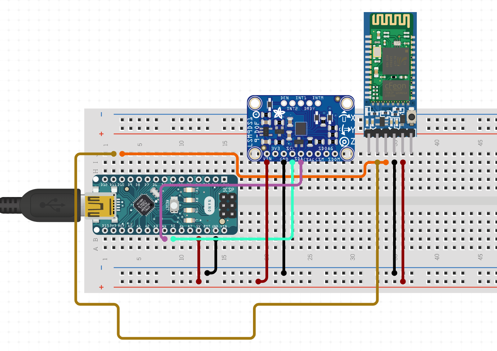

# Hackathon-Mouse-Cursor
Project for the Loyola Hackathon. The idea is to create an innovative computer mouse.

<html>
  <h1><u><b>Project Name:</b></u> Free Mouse</h1>
    
  <h2><u>Team member(s):</u> </h2><h3>Victor Rakotondranoro</h3>
   
 
  <h2><u>Quick biography:</u></h2> 
  Hi, I am Victor Rakotondranoro, a junior majoring in software engineering at Loyola. I am from Madagascar and I grew up in Ethiopia. This year 2021 will be my fourth year living in the USA. Although I started my first three semesters at Loyola majoring in business, I re-discovered my passion in technology and decided to transfer to the department of computer science and study software engineering. I have been exploring many areas and ideas in tech (software and hardware), and I look forward to learn even more things.
   
 
  <h2><u>Project description and motivation:</u></h2> 
  This project is an attempt to creating an innovative mouse. As a programmer, I spend a lot of time sitting on my desk while programming. As a result, I noticed that my back began to curve a little bit. So I thought about a way to minimize the curve and I came up with an idea. Why not create a mouse that won't require me to curve my back. Imaging being able to control the mouse pointer while leaning comfortably on your chair. 
   In this project, I will be creating a mouse that won't require a table, a mousepad, or any other surface to move the pointer. The only thing that is needed is the mouse and that's it. The mouse will be attached to the user's finger and the only thing they have to do is move their finger and the pointer will follow.
   
 
  <h2><u>Material needed:</u></h2> 
  - Arduino nano  
  - gy-521 module  
  - battery  
  - buttons  
  - breadboard and wires  
  - bluetooth module
   
 
  <h2><u>How will it work?:</u></h2> 
  The idea is to use the gyroscope from the gy-521 module to read the movement of the user's finger. Everything will be attached to the arduino which will read the data and use the bluetooth module to connect everything to the computer. I am planning to use a python library to control the mouse pointer, which will move according to the data returned by the gyroscope.
   
 
  <h2><u>Circuit similator:</u></h2> 
  
   
 
  <h2><u>Platform:</u></h2> <h3>Desktop</h3> 
  
</html>
